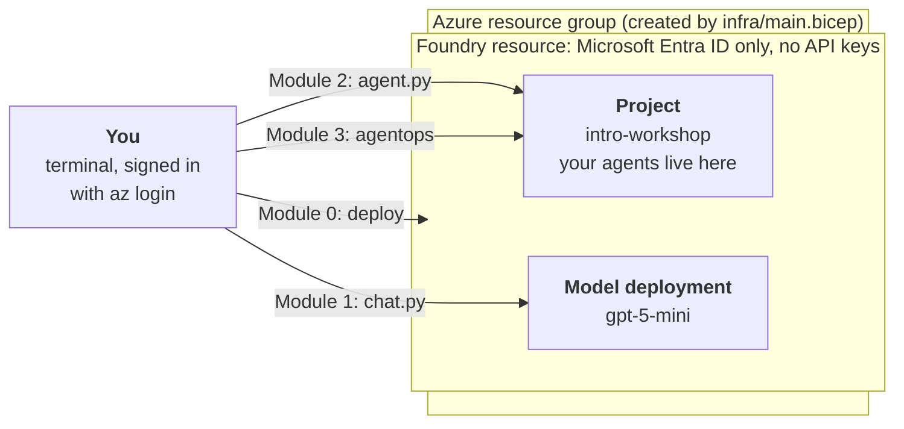

# Introduction to Microsoft Foundry

A short, hands-on workshop: deploy a Microsoft Foundry environment, call a model, build a versioned
agent, then prove it is good enough to ship instead of just working. About 60 minutes, Python.

Everything here was run end to end against a live Azure subscription on 2026-09-26 with
`azure-ai-projects` 2.7.0. Where a tool is pre-release, we say so.

## Why this exists

We teach teams to build agents on Microsoft Foundry, and the question that decides whether an agent
ships is not "does it respond" but "how do we know it's safe to ship?" This is the workshop we run with
clients: a fast, working first agent, plus the evaluation and release gate that most tutorials skip.

It uses the current `azure-ai-projects` 2.x SDK. Note that 2.x is not compatible with 1.x, so mix
carefully if you also follow older examples.

## Who it's for

Developers, architects and engineering leads who can read Python and use a terminal, and want a
working first agent on Microsoft Foundry plus a credible answer to "how do we know it's safe to ship?"
No prior Foundry or AI experience needed. Not aimed at production platform design (see the last caveat).

## By the end you can

- Deploy a Foundry resource, project and model as code, with key-based access disabled
- Call a model and build a versioned agent with multi-turn memory using the current SDK
- Explain how the current Foundry model and agent workflow fits together
- Score an agent, enforce a pass/fail quality gate, and generate a release-readiness report

## The big picture

You run a few commands from your terminal. The first one creates everything in Azure. The rest call it.



## Your path

| Module | Time | Objective | You leave with |
| --- | --- | --- | --- |
| [0. Deploy & connect](./module-0-setup/README.md) | ~15 min | Stand up a working environment | A Foundry project and model, no API keys |
| [1. Chat with a model](./module-1-chat-with-a-model/README.md) | ~5 min | Make your first Foundry call | Proof your auth, endpoint and model work |
| [2. Build an agent](./module-2-build-an-agent/README.md) | ~10 min | Build a named, versioned agent | An agent that remembers the last question |
| [3. Evaluate & govern](./module-3-evaluate-and-govern/README.md) | ~25 min | Prove the agent is fit to ship | A quality gate you can put in CI |

Times are approximate, and Module 0 depends on Azure deployment time.

## Key terms

You will see these words throughout. Read them once now.

| Term | Plain meaning |
| --- | --- |
| **Foundry resource** | The Azure resource that holds everything: your models, projects and settings |
| **Project** | A workspace inside the resource. Your agents live here. Your code connects to a project |
| **Endpoint** | The web address of your project. You set it once as `FOUNDRY_PROJECT_ENDPOINT` |
| **Model deployment** | A model made available to call, here `gpt-5-mini` |
| **Responses API** | How you send a prompt to a model and get an answer back |
| **Agent** | A named, versioned definition: a model plus standing instructions |
| **Conversation** | The thing that gives an agent memory. Reuse its ID across turns |
| **Evaluation** | Scoring an agent's answers with a judge model |
| **Threshold** | A pass mark for a score. Missing it fails the run with exit code 2 |

## Before you start

You need:

- An Azure subscription where you can create resources and assign roles (**Owner** or equivalent)
- Python 3.10+ and the [Azure CLI](https://learn.microsoft.com/cli/azure/install-azure-cli) with Bicep
- About 5 minutes of deployment time and a few cents of model usage
- **Windows:** the commands are bash. Use [WSL2](https://learn.microsoft.com/windows/wsl/install) and
  run everything, including `az login`, inside the WSL2 terminal. Native PowerShell was not tested.

Quick check that your tools are ready:

```bash
python3 --version   # 3.10 or higher
az version          # prints a version, no error
```

## Quick start

Five steps. After each one there is a check, so you know it worked before moving on.

**Step 1. Get the code and install.**

```bash
git clone https://github.com/codetocloudorg/intro-to-microsoft-foundry.git
cd intro-to-microsoft-foundry
python3 -m venv .venv && source .venv/bin/activate
pip install -r requirements.txt
```

Check: `pip list` shows `azure-ai-projects` 2.x.

**Step 2. Sign in to Azure.**

```bash
az login
```

Check: a browser opens, you sign in, and the terminal lists your subscriptions.

**Step 3. Deploy the environment.** This is the slow step, a few minutes.

```bash
az group create -n rg-foundry-workshop -l eastus2
az deployment group create -g rg-foundry-workshop --template-file infra/main.bicep \
  --parameters principalId=$(az ad signed-in-user show --query id -o tsv)
```

Check: the output ends with `"provisioningState": "Succeeded"` and shows a `projectEndpoint` value.

**Step 4. Tell the scripts where your project is.** Copy `projectEndpoint` from the output:

```bash
export FOUNDRY_PROJECT_ENDPOINT="https://<resource>.services.ai.azure.com/api/projects/intro-workshop"
```

Check: `echo $FOUNDRY_PROJECT_ENDPOINT` prints the address.

**Step 5. Run the first two modules.**

```bash
python module-1-chat-with-a-model/chat.py
python module-2-build-an-agent/agent.py
```

Check: Module 1 prints an answer about France. Module 2 prints `Agent created ...` and then two answers,
the second one naming Paris. Then continue to [Module 3](./module-3-evaluate-and-govern/README.md).

When you are done, delete everything: `az group delete -n rg-foundry-workshop --yes`.

Authentication is `DefaultAzureCredential`. The template disables key-based access, so there are no
API keys to leak.

## What you will see

Real output from a run on 2026-09-26 (model answers vary):

```text
$ python module-2-build-an-agent/agent.py
Agent created (id: code-to-cloud-intro-agent:1, name: code-to-cloud-intro-agent, version: 1)
France's total area (including overseas regions) is about 248,573 square miles (643,801 km²).
The capital of France is Paris ...

$ agentops eval run
[1/3] scored: coherence=5.00, fluency=4.00, similarity=5.00, response_completeness=5.00, avg_latency_seconds=2.70
...
Threshold status: PASSED            # exit code 0; a missed threshold prints FAILED and exits 2

$ agentops doctor --evidence-pack
Release readiness: ready_with_warnings
Findings: 8 (7 warning · 1 info)
```

## The current model and agent workflow, in five lines

- Deploy a model in your project. Call it with `project.get_openai_client()` and the **Responses API**.
- An agent is a **named, versioned definition**: `project.agents.create_version(...)`. Calling it again
  creates version 2.
- Multi-turn memory comes from a **conversation** object passed to each response call.
- The Foundry data-plane role is **Foundry User** (formerly "Azure AI User", same role ID). Owner
  alone cannot call the project's APIs.
- `azure-ai-projects` 2.x is the "Foundry projects (new)" API. Do not mix it with 1.x examples.

## Caveats

- Foundry's SDK moves quickly. The code follows Microsoft's
  [current quickstart](https://learn.microsoft.com/en-us/azure/foundry/quickstarts/get-started-code);
  check it first if a call fails after a new SDK release.
- Module 3 uses the AgentOps Accelerator, which is **pre-1.0** (0.15.1 when tested). Its version is
  pinned in `requirements-module3.txt`.
- The Bicep template creates a public-endpoint, Entra-only environment for learning. It is not a
  production landing zone. For that, see
  [Azure AI Landing Zones](https://github.com/Azure/AI-Landing-Zones).

## Where to go next

- **See where your organization stands.** The free
  [Agentic AI Readiness Scorecard](https://codetocloud.io/agentic-ai-scorecard/?utm_source=github&utm_medium=readme&utm_campaign=intro-foundry-workshop)
  takes a few minutes and needs no email.
- **Go from workshop to platform.** Our write-up of the
  [Azure AI Landing Zones design checklist](https://codetocloud.io/blog/azure-ai-landing-zones/?utm_source=github&utm_medium=readme&utm_campaign=intro-foundry-workshop)
  covers identity, networking and policy.
- **Run this with your team.** We deliver it as a working session on your own use case.
  [Book a discovery call](https://calendly.com/kevin-evans-codetocloud/intro-sync?utm_source=github&utm_medium=readme&utm_campaign=intro-foundry-workshop).

## About

Built by [Code To Cloud](https://codetocloud.io/?utm_source=github&utm_medium=readme&utm_campaign=intro-foundry-workshop),
an agentic DevOps and cloud advisory practice in Calgary, Alberta. The write-up:
[A Hands-On Introduction to Microsoft Foundry](https://codetocloud.io/blog/introduction-to-microsoft-foundry-workshop/?utm_source=github&utm_medium=readme&utm_campaign=intro-foundry-workshop).
Issues and pull requests are welcome. Licensed under the MIT License.
